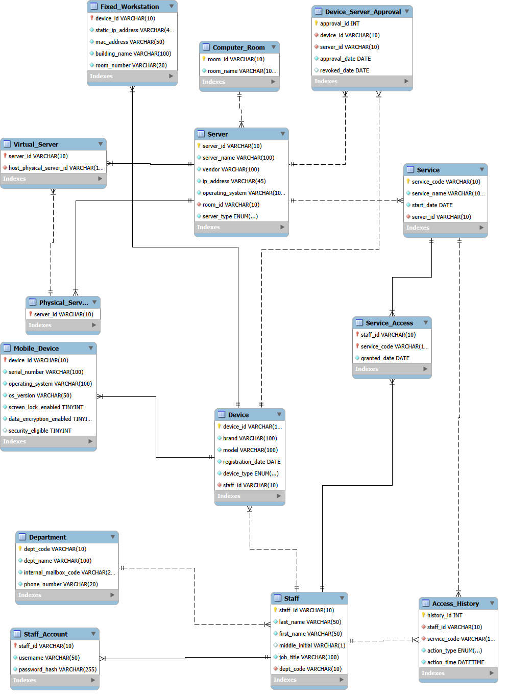

# MEDLINK HOSPITAL DEVICE ACCESS

---

## Giới thiệu

**MedLink Hospital Device Access** là dự án xây dựng cơ sở dữ liệu quan hệ phục vụ quản lý hạ tầng công nghệ thông tin (IT Infrastructure) trong môi trường bệnh viện. Hệ thống được thiết kế nhằm hỗ trợ quản lý tập trung các thành phần của hạ tầng CNTT, bao gồm khoa/phòng, nhân sự, tài khoản, phòng máy, máy chủ, thiết bị, dịch vụ CNTT và quyền truy cập của người dùng.

Trong thực tế, các bệnh viện hiện đại sử dụng nhiều hệ thống máy chủ, thiết bị đầu cuối và dịch vụ CNTT khác nhau. Nếu không có một cơ sở dữ liệu quản lý thống nhất, việc cấp quyền truy cập, theo dõi thiết bị và kiểm soát an toàn thông tin sẽ gặp nhiều khó khăn. Dự án này được xây dựng nhằm giải quyết bài toán đó thông qua một cơ sở dữ liệu được thiết kế theo mô hình quan hệ, đảm bảo tính toàn vẹn, bảo mật và khả năng mở rộng.

Hệ thống được triển khai trên **MySQL 8.0**, áp dụng các kỹ thuật chuẩn hóa dữ liệu, khóa chính, khóa ngoại, ràng buộc toàn vẹn, Trigger, Stored Procedure, Function, View và Secondary Index nhằm tối ưu hiệu năng truy vấn và hỗ trợ quản trị dữ liệu hiệu quả.

---

# Sơ đồ ERD

Sơ đồ thực thể - liên kết (Entity Relationship Diagram) mô tả cấu trúc và mối quan hệ giữa các bảng trong cơ sở dữ liệu.

[📥 Xem ảnh gốc](erd.png)

---

# Mục tiêu của dự án

Hệ thống được xây dựng nhằm:

- Quản lý thông tin khoa/phòng.
- Quản lý hồ sơ nhân sự.
- Quản lý tài khoản đăng nhập.
- Quản lý phòng máy.
- Quản lý máy chủ vật lý và máy chủ ảo.
- Quản lý thiết bị CNTT.
- Quản lý các dịch vụ CNTT.
- Quản lý quyền sử dụng dịch vụ của nhân viên.
- Phê duyệt thiết bị trước khi truy cập máy chủ.
- Ghi nhận lịch sử cấp và thu hồi quyền truy cập.
- Hỗ trợ thống kê và khai thác dữ liệu phục vụ công tác quản trị.

---

# Công nghệ sử dụng

| Thành phần | Công nghệ |
|------------|-----------|
| Hệ quản trị CSDL | MySQL 8.0 |
| Công cụ thiết kế | MySQL Workbench |
| Ngôn ngữ | SQL |
| Quản lý mã nguồn | GitHub |
| Định dạng tài liệu | Markdown |

---

# Mô hình dữ liệu

Cơ sở dữ liệu gồm **14 bảng**, được chia thành bốn nhóm chức năng.

## Quản lý tổ chức

- Department
- Staff
- Staff_Account

## Quản lý hạ tầng CNTT

- Computer_Room
- Server
- Physical_Server
- Virtual_Server
- Service

## Quản lý thiết bị

- Device
- Fixed_Workstation
- Mobile_Device

## Quản lý phân quyền

- Service_Access
- Device_Server_Approval
- Access_History

Toàn bộ cơ sở dữ liệu được chuẩn hóa đến **Third Normal Form (3NF)** nhằm giảm dư thừa dữ liệu và đảm bảo tính toàn vẹn.

---

# Các chức năng chính

- Quản lý nhân sự.
- Quản lý khoa/phòng.
- Quản lý tài khoản.
- Quản lý máy chủ.
- Quản lý phòng máy.
- Quản lý thiết bị.
- Quản lý dịch vụ CNTT.
- Quản lý quyền truy cập.
- Phê duyệt thiết bị.
- Theo dõi lịch sử truy cập.
- Báo cáo và thống kê.

---

# Thành phần kỹ thuật

## Views

- `vw_StaffServiceAccess`
- `vw_DeviceSecurityStatus`

Hỗ trợ tổng hợp dữ liệu và đơn giản hóa các truy vấn báo cáo.

---

## Stored Procedures

- `sp_GrantServiceAccess`
- `sp_ApproveDeviceAccess`

Tự động hóa quy trình cấp quyền dịch vụ và phê duyệt thiết bị.

---

## Function

- `fn_CountStaffServices`

Đếm số lượng dịch vụ mà một nhân viên đang được cấp quyền.

---

## Triggers

- `trg_log_service_access_insert`
- `trg_log_service_access_delete`
- `trg_check_mobile_security`

Các Trigger giúp tự động ghi nhận lịch sử thao tác và kiểm tra điều kiện bảo mật trước khi cho phép truy cập máy chủ.

---

## Secondary Index

- `idx_staff_dept_fullname`
- `idx_device_registration_date`

Các chỉ mục được xây dựng nhằm tối ưu hiệu năng của các truy vấn thường xuyên.

# SQL Query Pack

Tệp **03_queries.sql** chứa tập hợp các câu lệnh SQL được xây dựng nhằm khai thác dữ liệu, kiểm thử các chức năng của hệ thống và minh họa khả năng xử lý dữ liệu của cơ sở dữ liệu MedLink Hospital Device Access.

Các câu truy vấn được thiết kế dựa trên các nghiệp vụ thực tế trong quản lý hạ tầng CNTT của bệnh viện và bao gồm nhiều mức độ từ cơ bản đến nâng cao.

Nội dung chính của tệp gồm:

- Truy vấn thông tin nhân sự theo khoa/phòng.
- Tra cứu tài khoản của nhân viên.
- Thống kê số lượng nhân viên theo từng khoa.
- Truy vấn danh sách máy chủ theo phòng máy.
- Tra cứu thiết bị theo loại hoặc trạng thái.
- Thống kê số lượng thiết bị theo từng loại.
- Danh sách dịch vụ mà một nhân viên được cấp quyền sử dụng.
- Kiểm tra các thiết bị đã được phê duyệt truy cập máy chủ.
- Thống kê lịch sử cấp và thu hồi quyền truy cập.
- Các truy vấn sử dụng `JOIN` giữa nhiều bảng.
- Các truy vấn thống kê với `GROUP BY`, `HAVING`.
- Truy vấn lồng (`Subquery`).
- Truy vấn sử dụng `Common Table Expression (CTE)`.
- Truy vấn khai thác dữ liệu từ các View của hệ thống.

📄 **Xem chi tiết:** [03_queries.sql](03_queries.sql)

---

Các câu truy vấn trong tệp này vừa phục vụ việc kiểm thử hệ thống, vừa minh họa cách khai thác dữ liệu để hỗ trợ quản trị hạ tầng CNTT, theo dõi quyền truy cập và xây dựng các báo cáo phục vụ công tác quản lý của bệnh viện.
---

# Tài liệu dự án

| Tài liệu | Mô tả |
|----------|------|
| [Báo cáo đồ án](MedLink_Hospital_Device_Access_Report.pdf) | Báo cáo hoàn chỉnh của dự án |
| [Sơ đồ ERD](erd.png) | Mô hình thực thể - liên kết |
| [01_schema.sql](01_schema.sql) | Tạo cơ sở dữ liệu và các bảng |
| [02_seed_data.sql](02_seed_data.sql) | Dữ liệu mẫu |
| [03_queries.sql](03_queries.sql) | Bộ câu truy vấn SQL |
| [04_views.sql](04_views.sql) | Tạo các View |
|  [05_routines.sql](05_routines.sql) | Stored Procedure và Function |
|  [06_triggers_events.sql](06_triggers_events.sql) | Trigger và Event |
|  [07_indexes_explain.sql](07_indexes_explain.sql) | Secondary Index và EXPLAIN |
|  [08_admin_backup.md](08_admin_backup.md) | Hướng dẫn Backup và Restore |
|  [09_tests.sql](09_tests.sql) | Kịch bản kiểm thử |

---

# Hướng dẫn triển khai

Thực hiện các tệp theo thứ tự sau:

1. **01_schema.sql** – Tạo cơ sở dữ liệu và các bảng.
2. **02_seed_data.sql** – Thêm dữ liệu mẫu.
3. **04_views.sql** – Tạo View.
4. **05_routines.sql** – Tạo Stored Procedure và Function.
5. **06_triggers_events.sql** – Tạo Trigger.
6. **07_indexes_explain.sql** – Tạo Secondary Index.
7. **03_queries.sql** – Thực hiện các truy vấn khai thác dữ liệu.
8. **09_tests.sql** – Kiểm thử toàn bộ hệ thống.
9. **08_admin_backup.md** – Thực hiện sao lưu và phục hồi cơ sở dữ liệu.

---

# Kiểm thử

Hệ thống đã được kiểm thử đối với:

- Tạo cơ sở dữ liệu.
- Tạo bảng.
- Ràng buộc dữ liệu.
- Dữ liệu mẫu.
- View.
- Stored Procedure.
- Function.
- Trigger.
- Secondary Index.
- SQL Query Pack.
- Backup và Restore.

Kết quả kiểm thử cho thấy các chức năng hoạt động đúng theo yêu cầu thiết kế.

---

# Nhóm thực hiện

**Nhóm 3**

Học phần: **Cơ sở dữ liệu**

Trường Quốc tế – Đại học Quốc gia Hà Nội

---

# Giấy phép

Repository được xây dựng phục vụ mục đích học tập và nghiên cứu trong học phần **Cơ sở dữ liệu**. Toàn bộ mã nguồn và tài liệu chỉ sử dụng cho mục đích học thuật.
